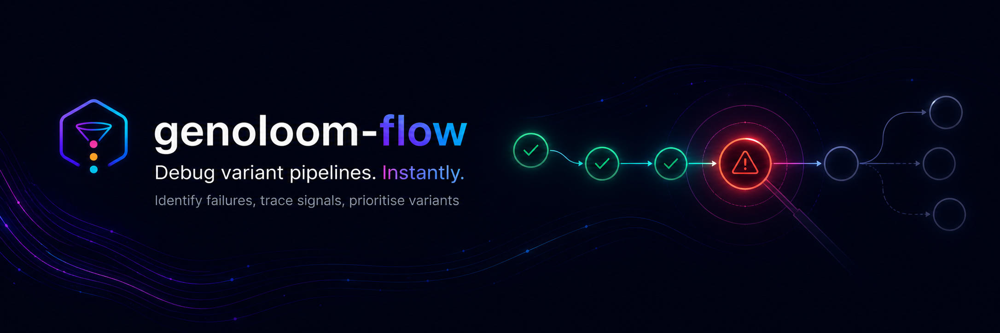

<p align="center">
  
</p>

# genoloom-flow

**Debug variant pipelines. Instantly.**

Interactive Nextflow workflow visualiser and debugger for identifying failures, tracing signals, and understanding pipeline behaviour.

---

## What it does

GenoLoom Flow helps you:

- Visualise Nextflow DAGs interactively
- Identify where pipelines fail
- Inspect node-level execution details
- Trace execution paths and signals
- View reports and timelines in context

---

## Why

Nextflow pipelines are powerful but hard to debug visually.  
When something breaks, you’re left digging through logs and scattered outputs.

GenoLoom Flow gives you a clear, visual way to:
- see where things went wrong
- understand pipeline flow
- move faster from failure → fix

---

## Features

- Upload and explore Nextflow DAGs
- Visualise pipeline structure with D3
- Track task status (running, completed, failed)
- Inspect node-level execution details
- View Nextflow reports and timelines inline
- Run local nf-core workflows

---

## Demo

Coming soon.

---

## Roadmap

- Real-time task updates
- nf-core workflow integration
- Cloud execution (AWS)
- Token-based auth + multi-user runs

---

## Requirements

- Python 3.10+
- Node.js 18+

---

## Running (development)

### Backend

```bash
cd backend
pip install -r requirements.txt
uvicorn app:app --reload
```

Runs at http://localhost:8000

### Frontend

```bash
cd frontend
npm install
npm run dev
```

Runs at http://localhost:5173

---

## Testing milestone 2A (dag.dot parsing)

```bash
curl http://localhost:8000/graph | python3 -m json.tool
```

---

## Sample run

sample_runs/example/dag.dot

---

## Author

Philip Lobb
