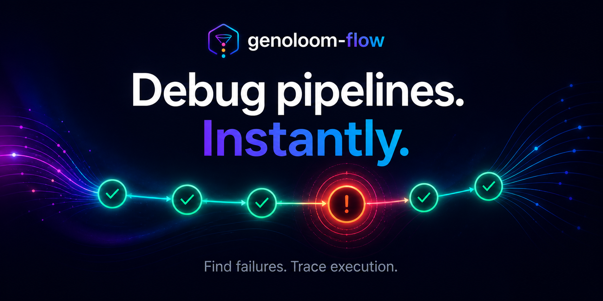

<p align="center">
  
</p>

# genoloom-flow

**Debug Nextflow pipelines. Instantly.**

GenoLoom Flow is a local-first Nextflow workflow visualiser and debugger. It helps you inspect pipeline structure, follow execution state, identify failed steps, and view run artefacts without constantly jumping between the terminal, work directories, reports, and logs.

---

## What it does

GenoLoom Flow helps you:

- Visualise Nextflow DAGs interactively
- Track task status across a run
- Identify failed or incomplete workflow steps
- Inspect node-level execution details
- View command, stdout, stderr, reports, and timelines in context
- Run local nf-core demo workflows
- Compare uploaded, simulated, sample, and local runs in one interface

---

## Why

Nextflow pipelines are powerful, but debugging them can be awkward.

When something fails, useful information is often scattered across:

- `dag.dot`
- `trace.txt`
- `.command.sh`
- `.command.out`
- `.command.err`
- `report.html`
- `timeline.html`
- the Nextflow work directory

GenoLoom Flow brings those pieces into a single visual debugging surface so you can move faster from failure to fix.

---

## Current features

- Interactive D3 workflow graph
- Upload and explore `dag.dot`
- Optional `trace.txt` status overlay
- Simulated demo workflow with live visual updates
- Local `nf-core/demo` execution
- Multiple run management
- Run source labels for sample, upload, demo, and local Nextflow runs
- Node inspector with execution metadata
- Embedded Nextflow report and timeline views
- In-app command, stdout, and stderr viewing
- Failed-node summary pane with suggested next checks

---

## Demo modes

GenoLoom Flow currently supports three main ways to explore a workflow.

### Sample run

Loads a bundled example graph and trace.

### Simulated workflow

Runs a frontend-only demo that animates node state changes. This is useful for demonstrations because it does not require compute.

### Local nf-core demo

Runs `nf-core/demo` locally through the backend and watches for Nextflow outputs such as `dag.dot`, `trace.txt`, `report.html`, and `timeline.html`.

---

## Screenshots

Coming soon.

---

## Roadmap

Planned areas of development:

- Better live trace polling
- Improved failed-task error extraction
- Full nf-core workflow catalogue support
- Workflow parameter forms based on `nextflow_schema.json`
- Containerised local deployment
- Token-based authentication
- AWS execution support
- Optional LLM-assisted error interpretation

---

## Requirements

- Python 3.10+
- Node.js 18+
- Nextflow, for local workflow execution
- Docker, for the local nf-core demo profile

---

## Running locally

### Backend

From the project root:

```bash
cd backend
pip install -r requirements.txt
uvicorn app:app --reload
```

The backend runs at:

```text
http://localhost:8000
```

### Frontend

In a second terminal:

```bash
cd frontend
npm install
npm run dev
```

The frontend runs at:

```text
http://localhost:5173
```

---

## Typical workflow

1. Start the backend.
2. Start the frontend.
3. Open `http://localhost:5173`.
4. Load a sample run, upload a DAG, run the simulated workflow, or launch `nf-core/demo`.
5. Click nodes to inspect task details.
6. Open reports, timelines, commands, stdout, and stderr inside the app.

---

## Useful Nextflow outputs

You can generate files for upload with:

```bash
nextflow run <pipeline> \
  -with-dag dag.dot \
  -with-trace trace.txt \
  -with-report report.html \
  -with-timeline timeline.html
```

---

## Development notes

This project is currently focused on local-first debugging and safe approved workflow execution.

It does not currently aim to execute arbitrary user-supplied shell commands from the browser.

---

## Author

Philip Lobb

---

## License

MIT
